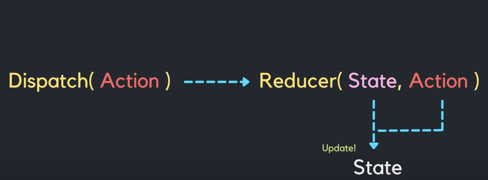

# [부트캠프에서 알려주지 않는 것들 (리액트) 1편](https://www.inflearn.com/course/%EB%B6%80%ED%8A%B8%EC%BA%A0%ED%94%84-%EC%95%8C%EB%A0%A4%EC%A3%BC%EC%A7%80%EC%95%8A%EB%8A%94%EA%B2%83%EB%93%A4-%EB%A6%AC%EC%95%A1%ED%8A%B8-part1/dashboard)

## useReducer

- useState처럼 state를 생성하고 관리
- 구조가 복잡한 데이터를 다뤄야 할 때 유용
- Dispatch를 통해 상태 업데이트를 알리며 어떠한 업데이트를 수행해야 하는지 내용을 담은 action object를 전달
- Reducer는 이전 상태와 action을 받고 이를 통해 새로운 상태를 반환



```jsx
const initialState = {count: 0};

function reducer(state, action) {
  switch (action.type) {
    case 'increment':
      return {count: state.count + 1};
    case 'decrement':
      return {count: state.count - 1};
    default:
      throw new Error();
  }
}

function Counter() {
  const [state, dispatch] = useReducer(reducer, initialState);
  return (
    <>
      Count: {state.count}
      <button onClick={() => dispatch({type: 'decrement'})}>-</button>
      <button onClick={() => dispatch({type: 'increment'})}>+</button>
    </>
  );
}
```

### Reference

[React 공식문서](https://ko.legacy.reactjs.org/docs/hooks-reference.html#usereducer)  
[유튜브채널 별코딩](https://www.youtube.com/watch?v=tdORpiegLg0&t=1102s)
