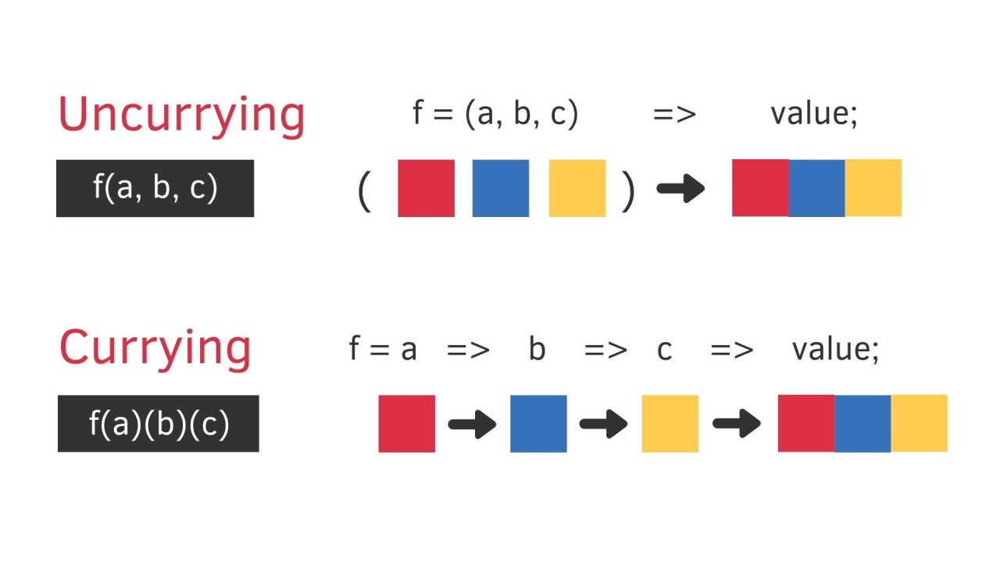

# [부트캠프에서 알려주지 않는 것들 (리액트) 1편](https://www.inflearn.com/course/%EB%B6%80%ED%8A%B8%EC%BA%A0%ED%94%84-%EC%95%8C%EB%A0%A4%EC%A3%BC%EC%A7%80%EC%95%8A%EB%8A%94%EA%B2%83%EB%93%A4-%EB%A6%AC%EC%95%A1%ED%8A%B8-part1/dashboard)

## currying

- 여러개의 인자를 받는 함수를 단일 인자를 받는 함수로 체이닝하는 기법
- 동일한 인수를 반복적으로 사용할 때 인수를 고정함으로서 중복을 최소화할 수 있다.
- 커링은 인자의 순서가 중요하므로, 변동 가능성이 적은 인자는 앞에 변동 가능성이 큰 인자는 뒤에 배치한다.

