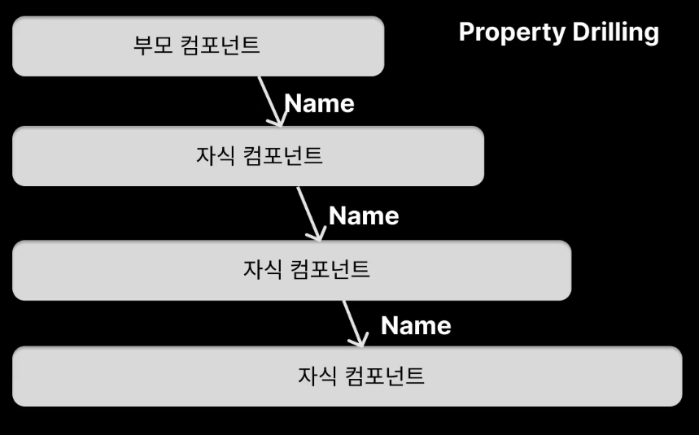
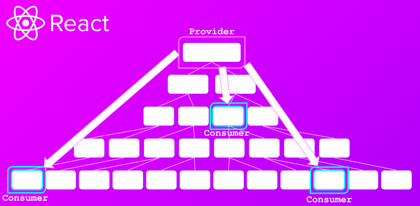

# [부트캠프에서 알려주지 않는 것들 (리액트) 1편](https://www.inflearn.com/course/%EB%B6%80%ED%8A%B8%EC%BA%A0%ED%94%84-%EC%95%8C%EB%A0%A4%EC%A3%BC%EC%A7%80%EC%95%8A%EB%8A%94%EA%B2%83%EB%93%A4-%EB%A6%AC%EC%95%A1%ED%8A%B8-part1/dashboard)

## useContext

### Props

- 리액트 애플리케이션의 규모가 커지며 관리하는 데이터 양의 늘어남에 따라 복잡성 증가
- 데이터를 전달할 때 중첩된 컴포넌트에게 명시적으로 props를 이용하여 넘겨줘야함
- 트리 깊숙히 위치한 컴포넌트에게 데이터를 전달 시 일일히 넘겨주는 복잡함과 불편함(Props Drilling)

### Context API

- context를 이용하면 일일히 props를 넘겨주지 않고 컴포넌트 트리 전체에 데이터를 전달할 수 있다.
- React.createContext 함수를 사용해 Context 객체를 만들고, Provider value로 데이터를 제공
- 해당 Context를 구독하는 컴포넌트에서 데이터를 사용할 수 있음
- 단, useContext를 호출한 컴포넌트는 Context값이 변경되면 항상 리렌더링된다. (Context를 구독하는 컴포넌트의 하위 트리 컴포넌트까지 영향을 미침)

